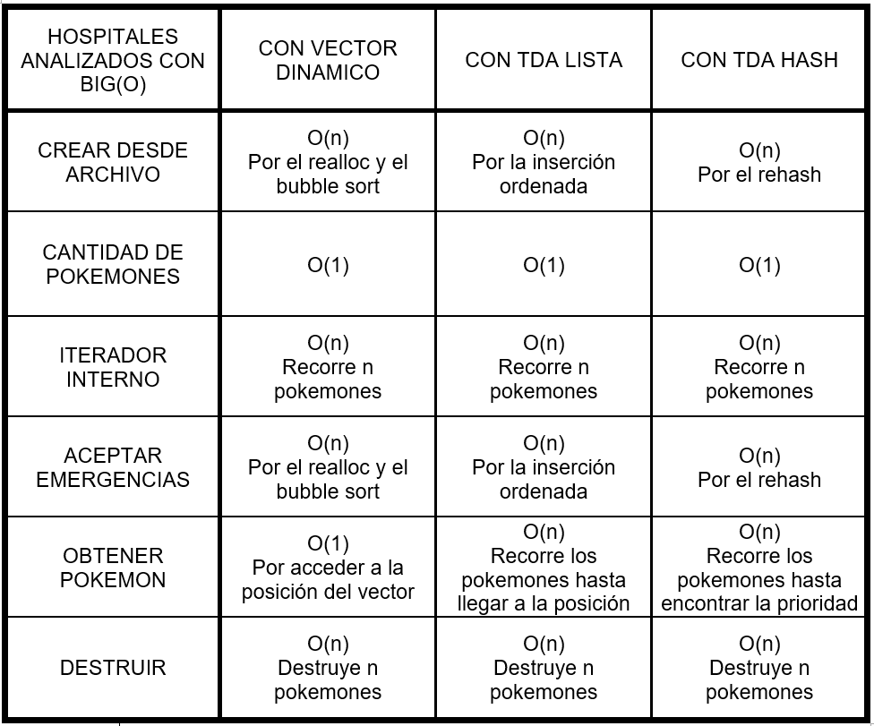

<div align="right">

</div>

# TP2

## Repositorio de Matias Ferrero - 109886 - mferreroc@fi.uba.ar

- Para compilar y correr el tp2:

```

```

- Para compilar y correr pruebas del TDA Menu con makefile:

```
make
```

- Para compilar y correr pruebas de la catedra con makefile:

```
make valgrind-chanutron
```
---
##  Funcionamiento


## Respuestas a las preguntas teóricas

Para la implementación del TP2, se carga el TDA Menú con los hospitales creados en el TP1. Estos hospitales están implementados con un `vector dinámico` de pokemones y dos números que guardan la cantidad de pokemones y entrenadores que hay en el hospital. 
Pero la estructura del hospital se puede modificar teniendo en cuenta los TDAs ya creados como el TDA Lista o el TDA Hash. Por ejemplo, al usar una `lista enlazada con nodos`, la estructura del hospital cambiaría el vector dinámico y la cantidad de pokemones por la lista, ya que cada nodo guarda un pokemón y la cantidad de nodos equivale a la cantidad de pokemones. Al reemplazar el vector por la lista enlazada, se pierde el acceso directo a la posición de cada pokemón, por lo que sería conveniente reemplazar el bubble sort al insertar, por una inserción ordenada. Haciendo este cambio en la implementación, no sería necesario hacer mas modificaciones, ya que con el TDA Lista se pueden realizar todas las operaciones del hospital, pero si se ven afectadas las complejidades algorítmicas de algunas funciones. Esta es una tabla con la comparación de las complejidades algorítmicas de las funciones de los hospitales con diferentes implementaciones:

<div  align="center">

</div>
