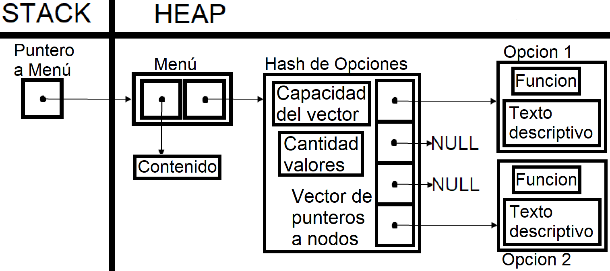
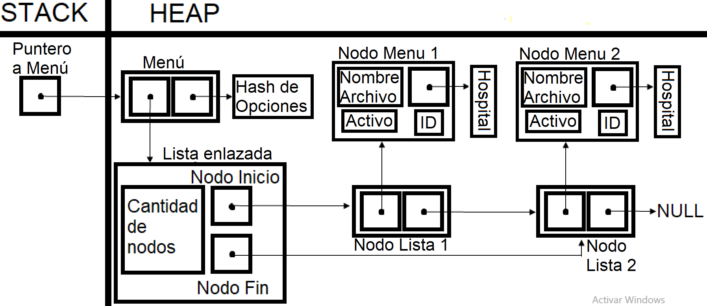

# TP2

## Repositorio de Matias Ferrero - 109886 - mferreroc@fi.uba.ar

- Para compilar y correr el tp2:

```
make valgrind-tp2
```

- Para compilar y correr pruebas del TDA Menu con makefile:

```
make
```

- Para compilar y correr pruebas de la catedra con makefile:

```
make valgrind-chanutron
```
---
##  Funcionamiento

Esta aplicación implementa un programa que, mediante el uso de un TDA Menú, mejora el manejo y permite la interacción del usuario con los hospitales de pokemones implementados en el TP1. El programa recibe los datos necesarios que entrega el usuario (archivos, números de identificaciones, funciones, etc.), y realiza las operaciones creadas.
Por otro lado, para la implementación del TDA Menú, también se implementa un TDA Opción, que guarda cada operación que se agrega al Menú. Para esto, el TDA Menú usa una tabla de Hash que almacena todas las opciones con sus nombres asociados; en la que cada Opción guarda una función, que recibe un void* por parámetro y devuelve un entero (para poder determinar estados según la función lo requiera), y además guarda un corto texto descriptivo de dicha función. Por último, cabe destacar que el TDA Menú también guarda un void* que sirve como contenido o contexto.

<div  align="center">

</div>

El TDA Menú en la función `menu_agregar` recibe un nombre con la función y el texto, y crea el TDA Opción que se guarda en el Hash con el nombre asociado, o la reemplaza por la Opción existente si el nombre ya fue ingresado. Para evitar problemas con la búsqueda de las operaciones en el Menú, en caso de escribir el misma nombre con mayúsculas, minúsculas, o con ambas, todas los nombres que se reciben al guardan una operación se transforman en mayúsculas con la función `toupper` (de la librería `ctype.h`).

```c
for (size_t i = 0; i < strlen(nombre_clave); i++)
		nombre[i] = (char)toupper(nombre_clave[i]);
```

Y así como para guardar operaciones se transforman los nombres a mayúsculas, para obtener y ejecutar una Opción en `menu_ejecutar_operacion` también se recibe y se cambia el nombre, se busca en el Hash, y se ejecuta la operación asociada, con el parámetro recibido de la función en cuestión, y se devuelve el retorno de dicha función. Y en caso de que se desee, `obtener_informacion` devuelve el texto del TDA Opción. 
Por otro lado,  `menu_obtener_contenido` devuelve el contexto del Menú que guarda el void*, y se puede modificar con `menu_cambiar_contenido`. Por ejemplo, en este apartado se pueden guardar los hospitales del programa.

Analizando la complejidad algorítmica de las funciones del TDA Menú con Big (O) obtenemos que:
- Crear: Reserva memoria para un Menú, y el Hash que guarda (operación O(1)).
- Obtener contenido: Devuelve lo que guarda el void* del TDA Menú (operación O(1)).
- Cambiar contenido: Destruye el contenido actual (si es necesario), y lo reemplaza por el nuevo (operación     O(1), pero depende de la complejidad de la función destructora).
- Agregar operación: Crea el TDA Opción con la función y el texto, y la inserta en el Hash (operación O(n) por la posibilidad de rehash).
- Ejecutar operación: Busca en el Hash la Opción asociada al nombre. Después, se ejecuta la función del TDA Opción (en casos promedio, es una operación O(1), pero se puede deformar en una operación O(n) debido a como funciona el Hash, aunque al final depende de la complejidad de la función recibida).
- Obtener información: Devuelve el texto del TDA Opción (operación O(1)).
- Cantidad de operaciones: Devuelve la cantidad de opciones guardados en la tabla de Hash (operación O(1)).
- Iterador interno: Itera todas las n operaciones y les aplica una función a cada una (operación O(n), pero depende de la función a invocar).
- Destruir: Libera la memoria reservada de las n operaciones, y le aplica una función destructora (si es necesario) al contenido guardado en el TDA Menú (operación O(n), pero depende de la complejidad de la función destructora).

Explicado como funciona el TDA Menú, el programa usa este TDA para guardar los hospitales ya implementados y las operaciones que se le pueden aplicar a estos hospitales. Para guardarlos se utiliza un TDA Nodo diferente a los ya vistos, que guarda cada hospital particular, junto con su archivo de origen, un numero de ID, y una variable booleana que permite identificar si el hospital esta activo para operar o no. Estos nodos a su vez, se insertan en un TDA Lista, el cual va a ser guardado por el Menú.

<div  align="center">

</div>

Las operaciones que se van a guardar en el Menú, y que se van a poder ejecutar son:
- Cargar archivo: Pide un archivo y un ID para crear el hospital y lo inserta en la lista del Menú (operación   O(n) por el realloc al crear el hospital).
- Activar hospital: Pide el ID de un hospital, y recorre los n hospitales hasta encontrar el pedido, lo activa, y si hay un hospital previamente activo, lo busca y lo desactiva (operación O(n), tanto buscar el hospital con ID correcto en la lista, como buscar el hospital previamente activo en la lista, ambas son operaciones O(n)).
- Mostrar hospitales: Muestra por pantalla los n hospitales insertados en la lista (operación O(n)).
- Destruir hospital: Busca y destruye el hospital activo (buscar y destruir un elemento en una posición de la lista son operaciones O(n)).
- Mostrar pokemones: Busca el hospital activo y muestra por pantalla los nombres de sus pokemones (buscar un elemento en la lista es una operación O(n)).
- Mostrar pokemones detallados: Busca el hospital activo y muestra por pantalla sus pokemones detalladamente (buscar un elemento en la lista es una operación O(n)).
- Mostrar operaciones: Recorre las n operaciones insertadas y las muestra por pantalla (es una operación O(n), pero como para este programa solo se agregan 8 operaciones, se podría considerar que la complejidad es O(8)).
- Salir: Libera la memoria del Menú y sale del programa (destruir una lista con sus n hospitales es una operación O(n)).

## Respuestas a las preguntas teóricas

Para la implementación del TP2, se carga el TDA Menú con los hospitales creados en el TP1. Estos hospitales están implementados con un `vector dinámico` de pokemones y dos números que guardan la cantidad de pokemones y entrenadores que hay en el hospital. 
Pero la estructura del hospital se puede modificar teniendo en cuenta los TDAs ya creados como el TDA Lista o el TDA Hash. Por ejemplo, al usar una `lista enlazada con nodos`, la estructura del hospital cambiaría el vector dinámico y la cantidad de pokemones por la lista, ya que cada nodo guarda un pokemón y la cantidad de nodos equivale a la cantidad de pokemones. Al reemplazar el vector por la lista enlazada, se pierde el acceso directo a la posición de cada pokemón, por lo que sería conveniente reemplazar el bubble sort al insertar, por una inserción ordenada. Haciendo este cambio en la implementación, no sería necesario hacer mas modificaciones, ya que con el TDA Lista se pueden realizar todas las operaciones del hospital, pero si se ven afectadas las complejidades algorítmicas de algunas funciones. Esta es una tabla con la comparación de las complejidades algorítmicas de las funciones de los hospitales con diferentes implementaciones:

<div  align="center">

</div>